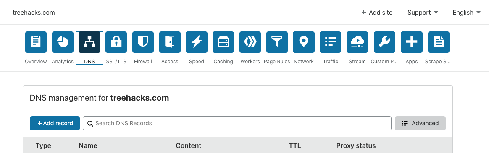

Our DNS records are handled by Cloudflare.

## Adding a new record

To add a new record, go to Cloudflare and add a record.

## Page Rules

We have some custom page rules set up on Cloudflare as well, which allow us to cache specific endpoints or create custom redirects.

For example, we have a custom page rule used to cache the API endpoint to get the list of all hacks from Gavel, for performance reasons.

## Warning about root CNAME records

In the summer of 2018, we wanted [https://treehacks.com](https://treehacks.com) to work properly (http:// and https://www. would work, but only https:// would give an error). We couldn't use Namecheap's default redirection service, because it wouldn't redirect https:// URLs. So, we tried adding a CNAME record at the root domain. However, this [is a bad idea](https://blog.cloudflare.com/introducing-cname-flattening-rfc-compliant-cnames-at-a-domains-root/) and ended up breaking all email for most of the summer, until we noticed it and reverted the CNAME record change.

We made a similar mistake in the summer of 2019. When switching from Namecheap to Cloudflare, we wanted to fix https://treehacks.com again, so we used Cloudflare's [CNAME flattening feature](https://blog.cloudflare.com/introducing-cname-flattening-rfc-compliant-cnames-at-a-domains-root/) to add a CNAME record at the root again. However, we forgot that Namecheap had provided us with email forwarding services, so all emails stopped working. Again, we only noticed this a while later. When we realized this, we switched our treehacks.com email handling to G Suite.

The lessons of this story are:

- When you make a big change to DNS, make sure you test that emails work immediately instead of waiting several weeks until the damage is done.

- [Cloudflare Page Rules](https://www.cloudflare.com/features-page-rules/) are probably a safer / more reliable way of doing redirects than doing DNS record redirection (with Page Rules, you can redirect from an SSL path as well -- so we could have solved our problem of https://treehacks.com using them without touching DNS).