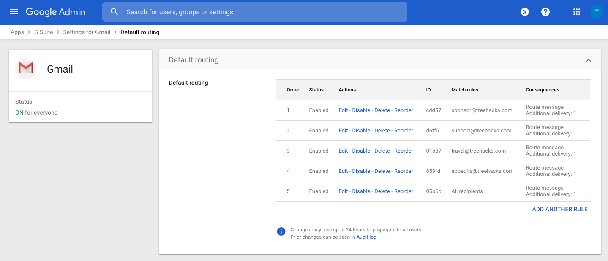

We have a single G Suite account with a single user -- hello@treehacks.com.

## Email routing

We handle all incoming email through [Freshdesk](https://freshdesk.com/). We can create multiple routing rules by going to the Gmail routing settings page ([https://admin.google.com/u/0/ac/apps/gmail/defaultrouting?hl=en&pli=1](https://admin.google.com/u/0/ac/apps/gmail/defaultrouting?hl=en&pli=1)):

We have the following routing rules set up:

- sponsor@treehacks.com -> treehackscomsponsor@treehacks.freshdesk.com
- support@treehacks.com -> treehackscomsupport@treehacks.freshdesk.com
- travel@treehacks.com -> treehackscomtravel@treehacks.freshdesk.com
- appedits@treehacks.com -> treehackscomappedits@treehacks.freshdesk.com
- [everything else]@treehacks.com -> hello@treehacks.com

These routing rules allow us to forward email to where it needs to go, without having to create multiple G Suite accounts for each email.