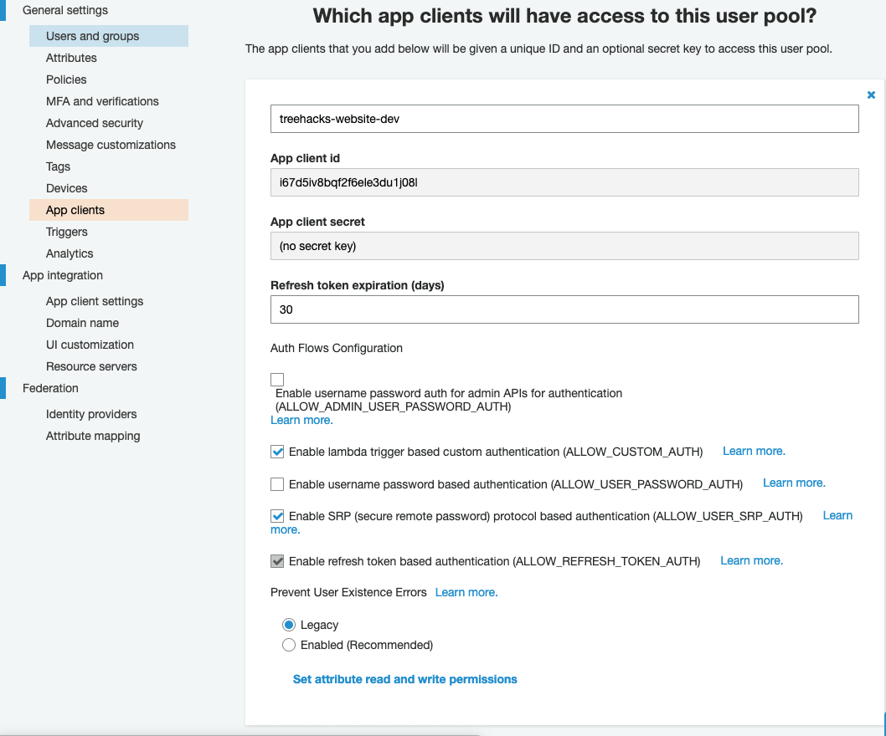

The login system is an SSO system that is used on all our sites. We use Cognito user pools for login, which allows people with non-@stanford.edu emails to create a username and password to sign in, while people with @stanford.edu emails can click "Log in with Stanford."

## Access control

Access control is done by using [Cognito groups](https://docs.aws.amazon.com/cognito/latest/developerguide/cognito-user-pools-user-groups.html). We have the following groups:

| Group Name      | Description |
| ----------- | ----------- |
| admin | Access to everything, all application data (only a few people, codirectors, tech should have this role) |
| reviewer | Access to review all applications on root (generally the whole TreeHacks team should have this role) |
| mentor | Access to be a mentor on help.treehacks.com (all mentors, when signing up with the special mentor link, are assigned this role) |
| sponsor | Access to Sponsor Portal (all sponsors, when created, are assigned this role) |
| judge | Judge access to Root (no longer used, todo delete this) |

## Stanford login

We use Stanford login, which integrates with our Cognito user pools. To do so, we have registered entries in SPDB, which is Stanford's database of which services are allowed to log in with Stanford.

### SPDB configuration

We have the following configs set up in SPDB:

[urn:amazon:cognito:sp:us-east-1_dvGgSVQIh](https://spdb.stanford.edu/spconfigs/4720) - connects with the treehacks-prod Cognito user pool

[urn:amazon:cognito:sp:us-east-1_zraMJaf9F](https://spdb.stanford.edu/spconfigs/4622) - connects with the treehacks-dev Cognito user pool

### Renewing SPDB config

Every year, sometime before September, you will receive an email that looks like the following:


This means that you need to renew the SPDB configuration for both dev and prod. Please open a [ServiceNow Ticket](https://stanford.service-now.com/services/) with Stanford with a message such as following:

> We would like to renew the following SPDB configs used for TreeHacks: https://spdb.stanford.edu/spconfigs/4720 and https://spdb.stanford.edu/spconfigs/4622.


## Setting up a Cognito user pool

Here are steps to follow if you are creating a new Cognito user pool from scratch for root. You may not need to do this regularly, as you can just reuse existing user pools each year, but these steps are documented in case they are needed:

!!! note
    These steps could also apply for integrating _any_ Cognito user pool with Stanford login, for non-TreeHacks-specific applications.

- When the pool is created, make sure you create it with the "Email address or phone number" option (rather than "username" option).

- Note down the pool id of your user pool. Set the `COGNITO_USER_POOL_ID` environment variable on login.treehacks.com equal to this value.


- Under "Message customizations", make sure that emails are sent through Amazon SES and "verification type" is set to "Code".


- Create a new lambda function with the contents of [root/util/conf_email_lambda.js](https://github.com/TreeHacks/root/blob/master/util/conf_email_lambda.js). Make sure to set the `COGNITO_USER_POOL_ID` and `WEBSITE` environment variables of this lambda function. Then, go to "Triggers" and select this lambda function as the "Custom message" trigger.


- Create a new app client. Make sure the settings are similar to the ones in the screenshot below. Note down the "app client id" value and set the `COGNITO_CLIENT_ID` environment variable on login.treehacks.com to be equal to this value.


- Under "App client settings", make sure that both "Stanford" and "Cognito User Pool" are selected identity providers, and the below OAuth 2.0 settings are set. You also want to set the callback / sign out URLs as below. Include `localhost:9000` if you have a dev user pool; otherwise, don't include the localhost URL.


### Setting up Stanford login with Cognito

- Set a domain name for your user pool. Note this value down (in this case it's "https://treehacks-prod.auth.us-east-1.amazoncognito.com"). You should set the `COGNITO_ENDPOINT_URL` environment variable on login.treehacks.com to be equal to this value:


- Create a new SAML identity provider named "Stanford". Set the value of the "Metadata" document to "https://idp.stanford.edu/metadata.xml" and click "Create provider".


- Click "Show signing certificate" for the Stanford identity provider and save the contents of a textbox to a safe place.


- Go to "Attribute mapping" and map the SAML attribute "urn:oid:1.3.6.1.4.1.5923.1.1.1.6" to the user pool attributes "Name" and "Email". (That number comes from [this link](https://uit.stanford.edu/service/saml/arp) -- it corresponds to `eduPersonPrincipalName`)


- Now, we have to apply for an exception with Stanford because Cognito does not support encrypted SAML assertions. This involves (see [this page](https://uit.stanford.edu/service/saml/exception) for Stanford's description of the exception process):

  - Create a ServiceNow Ticket with language such as the following:

  > The entityID of the Service Provider - urn:amazon:cognito:sp:us-east-1_he6sIPQW9 (fill this in with the right entityID, replacing the "us-east-1_he6sIPQW9" part with the right user pool ID)

  > Contact information for the Service Provider's technical support - [name], [email]

  > Reason why the Service Provider cannot support encrypted responses - Amazon Cognito does not supported encrypted responses

  > Number of people at Stanford who will be using application - thousands

  > Purpose of the application - Stanford signin for TreeHacks applicants

  > Name and email of the Service Provider's Stanford technical contact - [name], [email]

  > Name and email of the manager of the Stanford team responsible for this application - [name], [email]

  - Send an e-mail (ideally, it should be the TreeHacks faculty sponsor who sends the email, but you might also be able to send it) to saml-team@lists.stanford.edu agreeing to this text:

  > We are aware that by not encrypting the Identity Provider's SAML response there is an increased risk both of exposing the response's data and future security issues exploiting the unencrypted response, and that we accept this increased risk.

  - Create another [ServiceNow Ticket](https://stanford.service-now.com/services/) with the following language:

  > We'd like to integrate SAML login with an Amazon Cognito user pool for TreeHacks. Cognito does not support encrypted SAML assertions, so I would like to request an exception. I have already completed the steps outlined in https://uit.stanford.edu/service/saml/exception. I have attached the SAML metadata (metadata.xml) and signing certificate (cert.txt) for my SP. Could you please help upload this configuration to SPDB?

  > Additionally, AWS Cognito user pools do not work with the default NameID parameter. Can you set the Subject to <sunetid>@stanford.edu change the configuration to release eduPersonPrincipalName as NameID?

  The following files should be attached to the above ticket:

  - metadata.xml (make sure you change the `validUntil` attribute to a year from now, replace the last part of `entityID` with the user pool ID, replace `https://treehacks-prod.auth.us-east-1.amazoncognito.com` with your user pool's domain name, and replace the contact name / email addresses for technical and support contacts):

```xml
  <md:EntityDescriptor xmlns:md="urn:oasis:names:tc:SAML:2.0:metadata" validUntil="2021-02-27T20:58:21Z" cacheDuration="PT604800S" entityID="urn:amazon:cognito:sp:us-east-1_OzykbuXao">
    <md:SPSSODescriptor AuthnRequestsSigned="false" WantAssertionsSigned="false" protocolSupportEnumeration="urn:oasis:names:tc:SAML:2.0:protocol">
      <md:NameIDFormat>urn:oasis:names:tc:SAML:1.1:nameid-format:unspecified</md:NameIDFormat>
      <md:AssertionConsumerService Binding="urn:oasis:names:tc:SAML:2.0:bindings:HTTP-POST" Location="https://treehacks-prod.auth.us-east-1.amazoncognito.com/saml2/idpresponse" index="1"/>
    </md:SPSSODescriptor>
    <md:ContactPerson contactType="technical">
      <md:GivenName>Ashwin Ramaswami</md:GivenName>
      <md:EmailAddress>xxx@stanford.edu</md:EmailAddress>
    </md:ContactPerson>
    <md:ContactPerson contactType="support">
      <md:GivenName>Ashwin Ramaswami</md:GivenName>
      <md:EmailAddress>xxx@stanford.edu</md:EmailAddress>
    </md:ContactPerson>
  </md:EntityDescriptor>
```

  - cert.txt (put the contents of the user pool signing certificate into this text file)

- Wait and see! Hopefully the Stanford support representative will help you through the process if there are any issues -- eventually, they will create a SPDB config entry and Stanford login should work.

!!! note
    You might get an error when using Stanford login such as the following: `Error in SAML response processing: 1 validation error detected: Value 'stanford_.....' at 'userName' failed to satisfy constraint: Member must have length less than or equal to 128`. If this happens, please underscore the second point in the original support ticket (ask the representative to make sure they have set the Subject to `<sunetid>@stanford.edu` and released eduPersonPrincipalName as NameID).
